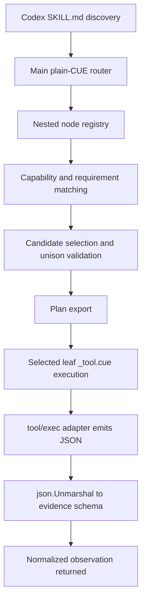

# App Abstraction as a Basis for a Codex Skill Router

## Executive summary

The `cue-lang/cue-deployment-patterns` repository’s `app-abstraction` branch **supports the architectural direction, but only with substantial adaptations**. The strongest part of the pattern is its **central plain-CUE abstraction layer**: a shared package defines closed schemas, a user instance unifies concrete inputs into that schema, policy overlays add target-specific constraints, and `cue export` materializes a selected output. That maps well to a **main plain-CUE router with a nested node registry** and a **plan-only export path**. It does **not** directly provide Codex skill discovery, `_tool.cue` leaf execution, candidate scoring, evidence normalization, or a Go `tools/flow` runner. citeturn7view0turn2view0turn5view0turn5view1turn3view2turn25view0

In practical terms, the repo demonstrates that CUE is excellent for **typed objectives, schema unification, policy layering, cross-node consistency, and materialized planning artifacts**. `platform.#Deployment` and `#App` are the key signals: they centralize allowed shapes; `policy.cue` tightens per-target rules; and `render` shows the output can be exported as a concrete, selected text artifact. Those are the exact ingredients you want for Pattern 6, but they stop at “rendered plan,” not “selected executable skill flow.” citeturn2view0turn3view0turn5view0turn5view1turn12view1

The correct recommendation for a **local Codex skill MVP** is to **reuse the repo’s central abstraction style**, rename and reshape it into a router package, generate one or a few broad `SKILL.md` entries from CUE metadata, keep executable leaf flows in separate `_tool.cue` files, and postpone a custom Go `tools/flow` runner until the MVP outgrows `cue export` plus `cue cmd`. On the user’s decision scale, the verdict is **supports with adaptations**. citeturn25view0turn25view1turn16view0turn23view1turn12view4

## Technical model and pattern mapping

The branch is small and explicit about what it is. The repo root calls the repository “**an experimental place**” for “common CUE-based deployment patterns,” and the `app-abstraction` subtree contains only `README.md`, `app.cue`, `render`, and `platform/{main.cue,policy.cue}`. In that subtree there is **no `SKILL.md`, no `_tool.cue`, and no Go runner**. That matters: what the repo proves is a **declarative abstraction-and-materialization pattern**, not a full orchestration runtime. citeturn7view0turn1view0turn3view1

The core abstraction lives in `platform/main.cue`. `#Deployment` declares three named slots—`preview`, `preprod`, and `prod`—each constrained to `#App`. It then builds a `deploymentTargets` object and iterates over it to derive `manifests` for each target. Separately, `#App` is currently a union over valid abstractions and resolves to `#WebApp`, which declares the permitted shape of an application. This is already very close to a **central router + nested registry** pattern: a centralized schema, named nodes, internal derived values, and a deterministic exported product. citeturn5view0turn22view0

`app.cue` shows how the repository expects consumers to work: a shared `base` object is unified into `preview`, `preprod`, and `prod`, and cross-target reuse is allowed directly in CUE, such as `preprod.scaling: prod.scaling`. That is an important signal for a Codex skill router because it shows CUE’s native strength for **multi-node unison and shared constraints**. In a router adaptation, the same pattern can express “candidate A and candidate B must agree on output schema,” or “auxiliary validator inherits the selected primary node’s evidence contract.” citeturn3view0

`policy.cue` is the other key piece. It overlays environment-specific hostname constraints on `#Deployment`, tightening what was otherwise only structurally valid. That maps directly to a Codex skill router’s need for **policy as a separate authority**. In the adapted design, `policy.cue` would stop being about hostnames and start being about routing constraints such as allowed objectives, required capabilities, shell permissions, or exact-output evidence schemas. citeturn5view1

The operational boundary is equally clear. The repo’s `render` file is a short shell wrapper around `cue export`, selecting one concrete expression and emitting text. CUE’s own documentation says `cue export` takes a configuration, evaluates an expression, and emits the value as **validated, concrete data**, failing if the result is not concrete. That gives the repo a built-in **plan/materialization path**, and that is precisely what a router MVP needs for **plan-only mode**. The difference is that the repo exports deployment manifests, while the router would export a `plan` object. citeturn3view2turn12view1

That leads to the pattern mapping:

- **Pattern 6, central plain-CUE router with nested node registry:** strongly supported in spirit. `#Deployment` plus `deploymentTargets` plus `policy.cue` are the closest analogue in the repo. The adaptation is to replace fixed deployment targets with node IDs and route-selection metadata. citeturn5view0turn5view1
- **Pattern 3, per-skill leaf `_tool.cue` execution:** not present in the repo. It must be added. The repo’s current “execution” is only export-time materialization via `render`. citeturn1view0turn3view1turn3view2
- **Pattern 4, generated `SKILL.md` projections:** not present, but the repo’s `cue export -e ... --out text` habit is a direct projection mechanism that can be repurposed to generate `SKILL.md` from a concrete markdown string. Codex’s own docs confirm `SKILL.md` is the required discovery artifact and that Codex starts discovery from `name` and `description`. citeturn3view2turn12view1turn25view0turn25view1
- **Pattern 5, Go `tools/flow` runner:** not present, and nothing in the repo points to a need for it in the MVP. The existing pattern is plain CUE plus export. `tools/flow` becomes relevant only when you need low-level workflow control, task introspection, or controller-owned final values. citeturn1view0turn12view4turn23view0



The diagram above is the right adaptation of the repo’s pattern, not a claim about what already exists in the branch. What already exists is the left half of that flow: a central declarative authority, derived named outputs, and concrete export. The right half—leaf execution and evidence normalization—must be added on top. citeturn5view0turn5view1turn3view2turn16view0turn14view3turn12view2

## Repo features versus required capabilities

| Feature | Present? | Notes | File references |
|---|---|---|---|
| Central plain-CUE authority | yes | `platform.#Deployment` and `#App` centralize the valid shapes and generated outputs. | `platform/main.cue`, `README.md` citeturn5view0turn2view0 |
| Nested named registry analogue | yes | The fixed named fields `preview`, `preprod`, and `prod`, plus `deploymentTargets`, are a strong analogue for a struct-keyed node registry. | `platform/main.cue` citeturn5view0 |
| Policy overlay layer | yes | `policy.cue` overlays per-target constraints without changing the structural model. | `platform/policy.cue` citeturn5view1 |
| Cross-node unification | yes | `app.cue` shares a `base` and reuses `prod.scaling` from `preprod`, showing cross-node constraint reuse. | `app.cue` citeturn3view0 |
| Plan-only export path | yes | `render` uses `cue export -e ... --out text`; CUE docs define `cue export` as evaluation to validated, concrete output. | `render`; CUE export docs citeturn3view2turn12view1 |
| Definitions for internal schema | yes | The repo uses `#Deployment`, `#App`, and `#WebApp`; CUE definitions are not emitted and need not be concrete. | `platform/main.cue`; CUE docs citeturn5view0turn22view0turn12view5 |
| Typed objectives for routing | no | The closest analogue is typed app abstraction, not typed task objectives like “search,” “lint,” or “refactor.” | `platform/main.cue`, `app.cue` citeturn5view0turn3view0 |
| Capability matching | no | The branch iterates all fixed targets; it does not filter candidates by capability or requirement predicates. | `platform/main.cue` citeturn5view0 |
| Candidate selection and priority | no | There is no scoring, priority field, or “select one best node” logic; all targets are materialized. | `platform/main.cue` citeturn5view0 |
| `_tool.cue` leaf execution | no | The subtree contains no `_tool.cue` files; the only operational entrypoint is `render`. | subtree listings; `render` citeturn1view0turn3view1turn3view2 |
| `tool/exec` shell adapter | no | The repo uses a shell wrapper around `cue export`, not a CUE workflow command with `tool/exec`. | subtree listings; `render` citeturn1view0turn3view2 |
| JSON evidence shaping and normalized observation | no | The exported product is YAML manifest text, not JSON-shaped observations unified with evidence schemas. | `platform/main.cue`; `render` citeturn5view0turn3view2 |
| Hidden-field router internals | no | The repo uses definitions and `let` bindings, but not hidden `_...` fields as an internal router workspace. | `platform/main.cue` citeturn5view0 |
| `SKILL.md` discovery or projection | no | There is no `SKILL.md` in the subtree; Codex discovery requires a skill directory anchored by `SKILL.md`. | subtree listings; Codex skills docs citeturn1view0turn25view0turn25view1 |
| Go `tools/flow` runner | no | The subtree contains no Go runtime; `tools/flow` is a possible later addition, not part of the pattern shown here. | subtree listings; flow docs citeturn1view0turn3view1turn12view4turn23view0 |

The table points to a clear conclusion: the branch already contains the **right declarative core** for a router, but almost all **execution-facing Codex/MVP requirements** are still missing. That makes the repo valuable as a design pattern, not as a drop-in implementation. citeturn5view0turn5view1turn3view2turn25view0

## Gaps and adaptations needed

The first adaptation is conceptual: rename the repo’s `platform` package into a **router package** and reinterpret the fixed environment keys as **named candidate nodes**. In the branch, `preview`, `preprod`, and `prod` are fixed deployment targets. In the skill-router version, those would become fields such as `rg`, `eslint`, `tsc`, or `refactorPlanner`, all constrained by a shared `#Node` definition. This is the cleanest way to preserve the repo’s strongest idea: **central schema first, concrete instance second, export last**. citeturn2view0turn5view0turn3view0

The second adaptation is to separate **routing** from **execution**. The repo keeps everything in plain CUE and exports a rendered artifact. That maps perfectly to **plan-only mode**. It does not map to executable leaf flows unless you add `_tool.cue` files. CUE’s tool package exists specifically for this boundary: it is visible only in `_tool.cue` files, and its documentation frames tools as the place where hermetic configuration is allowed to interact with outside systems. For the MVP, that means the router should stay plain CUE, while only selected leaves should import `tool/exec`. citeturn23view1turn16view0

The third adaptation is to add **candidate selection logic** that the repo does not currently need. Today the branch renders all three deployment targets. A skill router must usually pick one best primary flow, optionally with compatible auxiliary nodes. CUE supports this style well through ordinary unification and helper validators such as `matchN`, which can express “exactly one,” “at least one,” and “all of.” The repo already demonstrates the prerequisite discipline—named fields and closed definitions—so adding selection is natural even though it is not present yet. citeturn5view0turn12view7turn22view0

The fourth adaptation is to use **definitions and hidden fields intentionally**. CUE’s spec says definitions and hidden fields are not emitted when converting to data and are never required to be concrete. Separately, `cue help commands` says executable tasks are discovered as **regular fields under `command`**, excluding hidden fields and definitions. That combination is ideal for the recommended architecture: keep the node registry, candidate sets, scores, and internal checks in definitions or hidden fields inside the plain-CUE router; keep executable tasks as regular fields only inside selected leaf commands. citeturn12view5turn12view0

The fifth adaptation is to add **Codex-facing projections**. Codex discovery is explicitly `SKILL.md`-based, with progressive disclosure from `name` and `description` metadata first and the full markdown only after skill selection. The repo already demonstrates text projection through `cue export -e ... --out text`, so generating `SKILL.md` from a concrete markdown string is straightforward. The main design implication is that you should generate **one broad skill or a small number of broad family skills**, not one micro-skill per leaf node, because discovery starts from truncated metadata budgets. citeturn3view2turn12view1turn25view0turn25view1

The sixth adaptation is to introduce **normalized evidence schemas**. The branch produces deployment manifests; it does not shape observations from shell adapters. For the MVP, each leaf should make `tool/exec` produce JSON on `stdout`, then convert that JSON back into CUE data with `encoding/json.Unmarshal`, and finally unify it with a declared evidence schema. CUE’s workflow documentation explicitly shows JSON fetched by a task being converted into data inside the workflow, and the `tool/exec` API exposes `stdout`, `stderr`, `success`, `dir`, and `env`, which is exactly the boundary an adapter-based MVP needs. citeturn12view2turn14view0turn14view3turn14view4turn14view5

## Minimal implementation sketch

The lowest-friction adaptation is to preserve the repo’s package split and export habit, but change the semantics:

```text
.agents/
  skills/
    repo-router/
      SKILL.md              # generated from CUE
cue/
  router/
    main.cue               # adapted from platform/main.cue
    policy.cue             # adapted from platform/policy.cue
    evidence.cue           # declared observation schemas
  flows/
    rg_tool.cue            # selected leaf workflow
    eslint_tool.cue        # selected leaf workflow
scripts/
  gen-skill                # cue export -e skillMd --out text > .../SKILL.md
```

This preserves what the branch already proves: a centralized package with reusable definitions and a materialization/export path. It adds what the branch lacks: Codex discovery output and executable leaf flows. It also keeps the MVP aligned with Codex guidance that skills are discovered from `SKILL.md` and can include scripts, while keeping CUE as the policy authority behind that surface. citeturn2view0turn3view2turn25view0turn25view1

A proposed router adaptation, inspired by `platform.#Deployment`, looks like this:

```cue
package router

import "list"

#ObjectiveKind: "search" | "lint" | "refactor"

objective: {
	kind:         #ObjectiveKind @tag(kind)
	planOnly:     bool | *true @tag(planOnly,type=bool)
	shellAllowed: bool | *false @tag(shellAllowed,type=bool)
}

#Evidence: {
	kind: string
	data: _
}

#Node: {
	id:           string
	role:         "primary" | "aux"
	objectives:   [...#ObjectiveKind]
	capabilities: [...string]
	requires: {
		shell: bool | *false
	}
	priority: int | *0
	flow:     string
	outputs:  [string]: #Evidence
}

#registry: {
	rg: #Node & {
		id:           "rg"
		role:         "primary"
		objectives:   ["search"]
		capabilities: ["repo.grep"]
		requires: shell: true
		priority: 90
		flow:     "rgSearch"
		outputs: result: {
			kind: "search.lines"
			data: [...{
				path: string
				line: int
				text: string
			}]
		}
	}

	eslint: #Node & {
		id:           "eslint"
		role:         "primary"
		objectives:   ["lint"]
		capabilities: ["repo.lint.eslint"]
		requires: shell: true
		priority: 80
		flow:     "eslintLint"
		outputs: result: {
			kind: "lint.report"
			data: _
		}
	}
}

_candidates: {
	for name, n in #registry
	if list.Contains(n.objectives, objective.kind) &&
		(!n.requires.shell || objective.shellAllowed) {
		"\(name)": n
	}
}

_bestPriority: list.Max([for _, n in _candidates { n.priority }])

_selected: {
	for name, n in _candidates
	if n.priority == _bestPriority {
		"\(name)": n
	}
}

_primaryNames: [for name, n in _selected if n.role == "primary" { name }]
_primaryCount: 1 & len(_primaryNames)

plan: {
	objective:  objective
	candidates: _candidates
	selected:   _selected
	execute:    !objective.planOnly
}
```

This is deliberately plain CUE. It follows the same structural idea as the branch’s `#Deployment` plus `deploymentTargets` plus exported `manifests`, but changes the domain from deployment targets to leaf skills. It also keeps any injected parameters on ordinary fields rather than in comprehensions or optional fields, which aligns with CUE’s injection rules. citeturn5view0turn21view0turn21view2

A plan export can then mirror the repo’s existing `render` habit:

```sh
cue export ./cue/router -e plan \
  -t kind=search \
  -t planOnly=true \
  -t shellAllowed=true \
  --out json
```

That is the correct MVP “plan-only” path: the router remains hermetic and produces a concrete plan artifact before any side effect occurs. This is exactly the kind of export the repo already performs, only with `plan` in place of `yaml.MarshalStream(manifests.$1)`. citeturn3view2turn12view1

A matching broad-skill projection can be generated from CUE as well:

```cue
package router

skillMd: """
---
name: repo-router
description: Route repository tasks through a typed CUE router. Use for search, lint, and refactor planning inside this repo.
---

Always evaluate the CUE router first in plan-only mode.
Execute only the selected leaf workflow.
Return normalized evidence that matches the declared schema.
"""
```

That projection is not present in the repo today, but it is a direct extension of the repo’s export pattern and aligns with Codex’s required `SKILL.md` discovery format. citeturn3view2turn25view0turn25view1

The leaf execution path should move into `_tool.cue` and keep shell isolated behind `tool/exec`:

```cue
package flows

import (
	"encoding/json"
	"tool/cli"
	"tool/exec"
)

query: string @tag(query)
cwd:   string | *"." @tag(cwd)

#Evidence: {
	kind: "search.lines"
	data: [...{
		path: string
		line: int
		text: string
	}]
}

command: rgSearch: {
	run: exec.Run & {
		cmd: ["sh", "-c", "skill-rg-adapter --query \"$QUERY\" --cwd \"$CWD\""]
		env: {
			QUERY: query
			CWD:   cwd
		}
		dir:    cwd
		stdout: bytes
		stderr: string
	}

	evidence: #Evidence & json.Unmarshal(run.stdout)

	emit: cli.Print & {
		text: json.Marshal({
			flow:     "rgSearch"
			success:  run.success
			evidence: evidence
			stderr:   run.stderr
		})
	}
}
```

This is where the CUE docs and package boundaries matter most. `tool/exec` is the right adapter because it lets the workflow specify the command, working directory, environment, captured stdout/stderr, and success semantics. `encoding/json.Unmarshal` is the right evidence bridge because it turns adapter-produced JSON back into CUE data, which can then be unified with a declared schema before the final observation is emitted. citeturn23view1turn14view0turn14view3turn14view4turn14view5turn12view2

## Risk register

| Risk | Why it applies here | Mitigation |
|---|---|---|
| Domain mismatch | The branch is a deployment-rendering pattern, not a skill-orchestration runtime. Its success case is “all manifests rendered,” not “one best executable route chosen.” citeturn2view0turn5view0turn3view2 | Reuse only the central abstraction, policy, and export patterns. Do not treat the branch as proof that leaf execution semantics are solved. |
| Discovery gap | The subtree has no `SKILL.md`, while Codex discovery is explicitly skill-folder and `SKILL.md` based, starting from `name` and `description`. citeturn1view0turn25view0turn25view1 | Generate one or a few broad `SKILL.md` files from CUE metadata, and keep discovery coarse-grained. |
| Missing execution boundary | There are no `_tool.cue` files in the subtree; current execution is only a shell wrapper around `cue export`. citeturn1view0turn3view1turn3view2 | Add separate leaf `_tool.cue` files and keep the router itself plain CUE. |
| Workflow-command rough edges | The open `cmd v2` umbrella issue lists unresolved concerns around package interaction, task composition, readiness, failure handling, and nested-task UX. citeturn19view0 | Keep executable leaves flat and simple. Avoid a giant dynamic executable router graph in `_tool.cue`. |
| Hidden-task discovery traps | `cue help commands` says workflow tasks are discovered from regular `command` fields and exclude hidden fields and definitions. citeturn12view0 | Put router internals in hidden fields and definitions, but keep executable tasks as explicit regular fields in leaf commands only. |
| Evidence-shaping drift | The branch exports YAML manifests, not normalized tool observations, so evidence contracts would be a new layer. citeturn5view0turn3view2 | Require JSON-emitting adapters and unify their outputs with declared evidence schemas inside the `_tool.cue` workflow. |
| Premature `tools/flow` complexity | `tools/flow` is low-level, caller-defined, and not yet at a stable v1 package version; pkg.go.dev also shows modest visible adoption. citeturn12view4turn23view0 | Start with `cue export` for planning and `cue cmd` for leaves. Add a Go runner only when you need controller introspection, custom task recognition, or long-lived services. |
| Experimental-source risk | The repository itself is described as experimental and has no releases published. citeturn7view0 | Treat the branch as a pattern reference, not a stable product baseline. Pin your own implementation to a reviewed commit if you adopt it. |

## Open questions and limitations

This evaluation inspected the `app-abstraction` subtree on the branch as rendered on GitHub on **May 24, 2026**. Because the request did not pin a commit, line numbers and file contents may drift later. The conclusions about missing `_tool.cue`, `SKILL.md`, and Go runtime support are based on the files visible in that subtree at the time of inspection. citeturn1view0turn3view1turn7view0

The branch gives strong evidence for the **router/planner half** of the architecture, but not for the **execution/evidence half**. Those parts are grounded here in primary CUE and Codex documentation rather than in existing repo artifacts. That is why the result is “supports with adaptations,” not a stronger “supports directly.” citeturn5view0turn5view1turn16view0turn23view1turn25view0

## Final verdict

**Supports with adaptations.**

The repo’s `app-abstraction` pattern is a strong precedent for the **central plain-CUE router with a nested node registry** that you want for Pattern 6. It already demonstrates centralized schema authority, policy overlays, named-node derivation, cross-node unification, and export-based plan materialization. Those are the right foundations for typed objectives, workflow validation, and plan-only mode. citeturn2view0turn5view0turn5view1turn3view0turn12view1

It does **not** directly support Pattern 3, Pattern 4, or Pattern 5 without additional work. There are no `_tool.cue` leaves, no `tool/exec` adapters, no evidence schemas, no `SKILL.md` artifacts, and no `tools/flow` runtime in the subtree. For a local Codex skill MVP, the best move is therefore: **adopt the repo’s plain-CUE abstraction style for the router; add separate `_tool.cue` leaves for execution; optionally generate broad `SKILL.md` files from CUE; and defer `tools/flow` until you have a proven need for a custom runtime.** citeturn1view0turn3view1turn3view2turn23view1turn25view0turn12view4